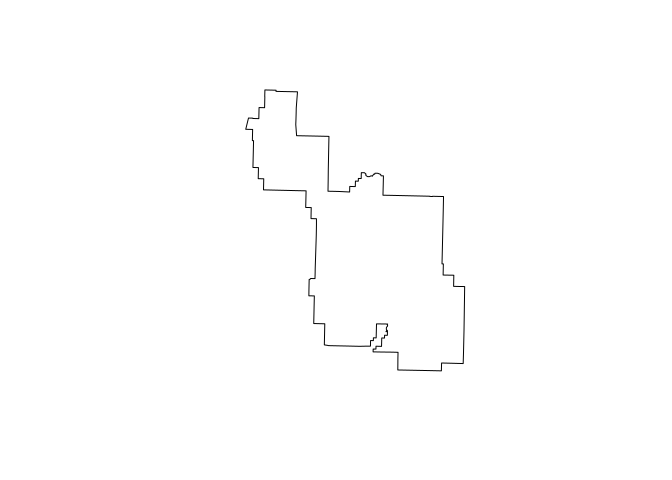
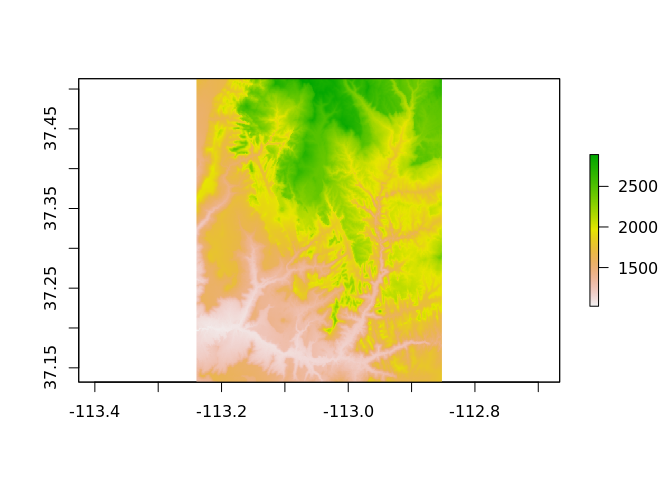
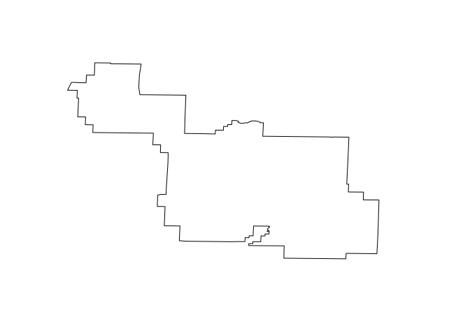

W2- Exercise 2
================

## Goals

  - Understand the provided datasets  
  - Learn how to reproject spatial data  
  - Limit your data into an area of interest  
  - Create a new map

We highlighted all parts of the R script in which you are supposed to
add your own code with:

# /Start Code/

``` r
print("Hello World") # This would be your code contribution
```

    ## [1] "Hello World"

# /End Code/

## Required R libraries

We will use the sf, raster, and tmap packages. Additionally, we will use
the spData and spDataLarge packages that provide new datasets. These
packages have been preloaded to the worker2 workspace.

``` r
library(sf)
```

    ## Linking to GEOS 3.6.2, GDAL 2.2.3, PROJ 4.9.3

``` r
library(raster)
```

    ## Loading required package: sp

``` r
library(tmap)
library(spData)
library(spDataLarge)
library(tidyverse)
```

    ## ── Attaching packages ─────────────────────────────────────── tidyverse 1.3.0 ──

    ## ✓ ggplot2 3.3.3     ✓ purrr   0.3.4
    ## ✓ tibble  3.0.6     ✓ dplyr   1.0.3
    ## ✓ tidyr   1.1.2     ✓ stringr 1.4.0
    ## ✓ readr   1.4.0     ✓ forcats 0.5.1

    ## ── Conflicts ────────────────────────────────────────── tidyverse_conflicts() ──
    ## x tidyr::extract() masks raster::extract()
    ## x dplyr::filter()  masks stats::filter()
    ## x dplyr::lag()     masks stats::lag()
    ## x dplyr::select()  masks raster::select()

## Data sets

We will use two data sets: `srtm` and `zion`. The first one is an
elevation raster object for the Zion National Park area, and the second
one is an sf object with polygons representing borders of the Zion
National Park.

``` r
srtm <- raster(system.file("raster/srtm.tif", package = "spDataLarge"))
zion <- read_sf(system.file("vector/zion.gpkg", package = "spDataLarge"))

# Additionally, the last exercise (IV) will used the masked version of the `lc_data` dataset.

study_area <- read_sf("data/study_area.gpkg")
lc_data <- raster("data/example_landscape.tif")
lc_data_masked <- mask(crop(lc_data, study_area), study_area)
```

## Exercise I

1.  Display the `zion` object and view its structure.

What can you say about the content of this file?  
What type of data does it store?  
What is the coordinate system used?  
How many attributes does it contain?  
What is its geometry?

2.  Display the `srtm` object and view its structure.  
    What can you say about the content of this file?  
    What type of data does it store?  
    What is the coordinate system used?  
    How many attributes does it contain?  
    How many dimensions does it have?  
    What is the data resolution?

Your solution (type answer to the questions as code comments and the
code used)

# /Start Code/

``` r
#1. Display the `zion` object and view its structure.
# What can you say about the content of this file?
#It is an sf object with polygons representing borders of the Zion National Park
#It has some meta data about such as date, name of the park, link to the full metadata and GNIS ID.
# What type of data does it store? 
zion %>% glimpse()# It's a vector object of the borders of Zion National Park.
```

    ## Rows: 1
    ## Columns: 12
    ## $ UNIT_CODE  <chr> "ZION"
    ## $ GIS_Notes  <chr> "Lands - http://landsnet.nps.gov/tractsnet/documents/ZION/…
    ## $ UNIT_NAME  <chr> "Zion National Park"
    ## $ DATE_EDIT  <date> 2017-06-22
    ## $ STATE      <chr> "UT"
    ## $ REGION     <chr> "IM"
    ## $ GNIS_ID    <chr> "1455157"
    ## $ UNIT_TYPE  <chr> "National Park"
    ## $ CREATED_BY <chr> "Lands"
    ## $ METADATA   <chr> "https://irma.nps.gov/App/Reference/Profile/2181118#Zion N…
    ## $ PARKNAME   <chr> "Zion"
    ## $ geom       <POLYGON [m]> POLYGON ((314945.2 4115910,...

``` r
#I think it contains 11 attributes besides its geometry.
srtm
```

    ## class      : RasterLayer 
    ## dimensions : 457, 465, 212505  (nrow, ncol, ncell)
    ## resolution : 0.0008333333, 0.0008333333  (x, y)
    ## extent     : -113.2396, -112.8521, 37.13208, 37.51292  (xmin, xmax, ymin, ymax)
    ## crs        : +proj=longlat +datum=WGS84 +no_defs +ellps=WGS84 +towgs84=0,0,0 
    ## source     : /home/cds-au615814/R/x86_64-pc-linux-gnu-library/4.0/spDataLarge/raster/srtm.tif 
    ## names      : srtm 
    ## values     : 1024, 2892  (min, max)

``` r
# What is the coordinate system used?
zion %>% st_crs() # here is the coordinate reference system that is used
```

    ## Coordinate Reference System:
    ##   No user input
    ##   wkt:
    ## PROJCS["UTM Zone 12, Northern Hemisphere",
    ##     GEOGCS["GRS 1980(IUGG, 1980)",
    ##         DATUM["unknown",
    ##             SPHEROID["GRS80",6378137,298.257222101],
    ##             TOWGS84[0,0,0,0,0,0,0]],
    ##         PRIMEM["Greenwich",0],
    ##         UNIT["degree",0.0174532925199433]],
    ##     PROJECTION["Transverse_Mercator"],
    ##     PARAMETER["latitude_of_origin",0],
    ##     PARAMETER["central_meridian",-111],
    ##     PARAMETER["scale_factor",0.9996],
    ##     PARAMETER["false_easting",500000],
    ##     PARAMETER["false_northing",0],
    ##     UNIT["Meter",1]]

``` r
# What is its geometry?
zion %>%  st_geometry() #this is it's geometry
```

    ## Geometry set for 1 feature 
    ## geometry type:  POLYGON
    ## dimension:      XY
    ## bbox:           xmin: 302903.1 ymin: 4112244 xmax: 334735.5 ymax: 4153087
    ## proj4string:    +proj=utm +zone=12 +ellps=GRS80 +towgs84=0,0,0,0,0,0,0 +units=m +no_defs

    ## POLYGON ((314945.2 4115910, 314803.7 4115949, 3...

``` r
zion %>%  st_geometry() %>% plot() #this is how it looks
```

<!-- -->

``` r
# 2. Display the `srtm` object and view its structure.
# What can you say about the content of this file? 

#It is an a single-band raster object for the elevation of Zion National Park area.
srtm  # Here is a summary of its dimens, resolution, extent coordinate reference system and so on.
```

    ## class      : RasterLayer 
    ## dimensions : 457, 465, 212505  (nrow, ncol, ncell)
    ## resolution : 0.0008333333, 0.0008333333  (x, y)
    ## extent     : -113.2396, -112.8521, 37.13208, 37.51292  (xmin, xmax, ymin, ymax)
    ## crs        : +proj=longlat +datum=WGS84 +no_defs +ellps=WGS84 +towgs84=0,0,0 
    ## source     : /home/cds-au615814/R/x86_64-pc-linux-gnu-library/4.0/spDataLarge/raster/srtm.tif 
    ## names      : srtm 
    ## values     : 1024, 2892  (min, max)

``` r
# What type of data does it store?
# It stores measures of elevation in a  single-band raster format

# What is the coordinate system used? 
srtm %>% crs() # Here is the coordinate system
```

    ## CRS arguments:
    ##  +proj=longlat +datum=WGS84 +no_defs +ellps=WGS84 +towgs84=0,0,0

``` r
# How many attributes does it contain?
srtm %>% glimpse()
```

    ## Formal class 'RasterLayer' [package "raster"] with 12 slots
    ##   ..@ file    :Formal class '.RasterFile' [package "raster"] with 13 slots
    ##   ..@ data    :Formal class '.SingleLayerData' [package "raster"] with 13 slots
    ##   ..@ legend  :Formal class '.RasterLegend' [package "raster"] with 5 slots
    ##   ..@ title   : chr(0) 
    ##   ..@ extent  :Formal class 'Extent' [package "raster"] with 4 slots
    ##   ..@ rotated : logi FALSE
    ##   ..@ rotation:Formal class '.Rotation' [package "raster"] with 2 slots
    ##   ..@ ncols   : int 465
    ##   ..@ nrows   : int 457
    ##   ..@ crs     :Formal class 'CRS' [package "sp"] with 1 slot
    ##   ..@ history : list()
    ##   ..@ z       : list()

``` r
# How many dimensions does it have? 
#I don't know how to find out
# What is the data resolution?
srtm %>% res() #this is the resolution
```

    ## [1] 0.0008333333 0.0008333333

# /End Code/

## Exercise II

1.  Reproject the `srtm` dataset into the coordinate reference system
    used in the `zion` object.  
    Create a new object `srtm2`  
    Vizualize the results using the `plot()` function.
2.  Reproject the `zion` dataset into the coordinate reference system
    used in the `srtm` object.  
    Create a new object `zion2`  
    Vizualize the results using the `plot()`function.  
    \# Your solution

# /Start Code/

``` r
zion%>% st_crs()
```

    ## Coordinate Reference System:
    ##   No user input
    ##   wkt:
    ## PROJCS["UTM Zone 12, Northern Hemisphere",
    ##     GEOGCS["GRS 1980(IUGG, 1980)",
    ##         DATUM["unknown",
    ##             SPHEROID["GRS80",6378137,298.257222101],
    ##             TOWGS84[0,0,0,0,0,0,0]],
    ##         PRIMEM["Greenwich",0],
    ##         UNIT["degree",0.0174532925199433]],
    ##     PROJECTION["Transverse_Mercator"],
    ##     PARAMETER["latitude_of_origin",0],
    ##     PARAMETER["central_meridian",-111],
    ##     PARAMETER["scale_factor",0.9996],
    ##     PARAMETER["false_easting",500000],
    ##     PARAMETER["false_northing",0],
    ##     UNIT["Meter",1]]

``` r
# Assign the CRS to srtm2
#I'm not sure what i'm doing...
crs_1 <- "+proj=longlat +ellps=WGS84 +units=m +no_defs"
srtm2 <- srtm

crs(srtm2) <- crs(crs_1)
srtm2 %>% plot()
```

<!-- -->

``` r
zion2 <- zion
srtm %>% crs()
```

    ## CRS arguments:
    ##  +proj=longlat +datum=WGS84 +no_defs +ellps=WGS84 +towgs84=0,0,0

``` r
crs_2 = "+proj=longlat +datum=WGS84 +no_defs
+ellps=WGS84 +towgs84=0,0,0 "

# Assign the CRS to zion
st_crs(zion2) <- crs(crs_2)
```

    ## Warning: st_crs<- : replacing crs does not reproject data; use st_transform for
    ## that

``` r
zion2 %>% st_geometry() %>% plot() #this looks weird...
```

    ## Warning in st_is_longlat(x): bounding box has potentially an invalid value range
    ## for longlat data

<!-- -->

# /End Code/
